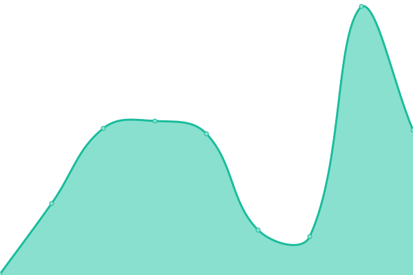

# [📈 Live Status](https://github.com/tzConnectBerlin/tzconnect-upptime): <!--live status--> **🟧 Partial outage**

With [Upptime](https://upptime.js.org), you can get your own unlimited and free uptime monitor and status page, powered entirely by a GitHub repository. We use [Issues](https://github.com/upptime/upptime/issues) as incident reports, [Actions](https://github.com/tzConnectBerlin/tzconnect-upptime/actions) as uptime monitors, and [Pages](https://upptime.github.io/upptime) for the status page.

<!--start: status pages-->
<!-- This summary is generated by Upptime (https://github.com/upptime/upptime) -->
<!-- Do not edit this manually, your changes will be overwritten -->
<!-- prettier-ignore -->
| URL | Status | History | Response Time | Uptime |
| --- | ------ | ------- | ------------- | ------ |
|  [Prediction Market](https://prediction-market.vercel.app/) | 🟩 Up | [prediction-market.yml](https://github.com/tzConnectBerlin/tzconnect-upptime/commits/HEAD/history/prediction-market.yml) | 

 76ms
     
 | 

<a href="https://tzConnectBerlin.github.io/tzconnect-upptime/history/prediction-market">100.00%</a>
    

|  [F1 Prediction Market](https://f1-prediction-market.vercel.app/) | 🟩 Up | [f1-prediction-market.yml](https://github.com/tzConnectBerlin/tzconnect-upptime/commits/HEAD/history/f1-prediction-market.yml) | 

 140ms
     
 | 

<a href="https://tzConnectBerlin.github.io/tzconnect-upptime/history/f1-prediction-market">99.98%</a>
    

|  [PMM Faucet](https://faucet.tzconnect.berlin/) | 🟩 Up | [pmm-faucet.yml](https://github.com/tzConnectBerlin/tzconnect-upptime/commits/HEAD/history/pmm-faucet.yml) | 

 557ms
     
 | 

<a href="https://tzConnectBerlin.github.io/tzconnect-upptime/history/pmm-faucet">100.00%</a>
    

|  [TZ Connect Website](https://tzconnect.com) | 🟩 Up | [tz-connect-website.yml](https://github.com/tzConnectBerlin/tzconnect-upptime/commits/HEAD/history/tz-connect-website.yml) | 

 470ms
     
 | 

<a href="https://tzConnectBerlin.github.io/tzconnect-upptime/history/tz-connect-website">100.00%</a>
    

|  [Hackathon Portal](https://hackathons.tzconnect.com/) | 🟩 Up | [hackathon-portal.yml](https://github.com/tzConnectBerlin/tzconnect-upptime/commits/HEAD/history/hackathon-portal.yml) | 

 225ms
     
 | 

<a href="https://tzConnectBerlin.github.io/tzconnect-upptime/history/hackathon-portal">100.00%</a>
    

|  [Mainnet Node](https://mainnet.newby.org/chains/main/blocks/head/header) | 🟥 Down | [mainnet-node.yml](https://github.com/tzConnectBerlin/tzconnect-upptime/commits/HEAD/history/mainnet-node.yml) | 

 803ms
     
 | 

<a href="https://tzConnectBerlin.github.io/tzconnect-upptime/history/mainnet-node">98.14%</a>
    

<!--end: status pages-->

[**Visit our status website →**](https://tzconnectberlin.github.io/tzconnect-upptime/)

## 📄 License

- Powered by: [Upptime](https://github.com/upptime/upptime)
- Code: [MIT](./LICENSE) © [Upptime](https://upptime.js.org)
- Data in the `./history` directory: [Open Database License](https://opendatacommons.org/licenses/odbl/1-0/)
